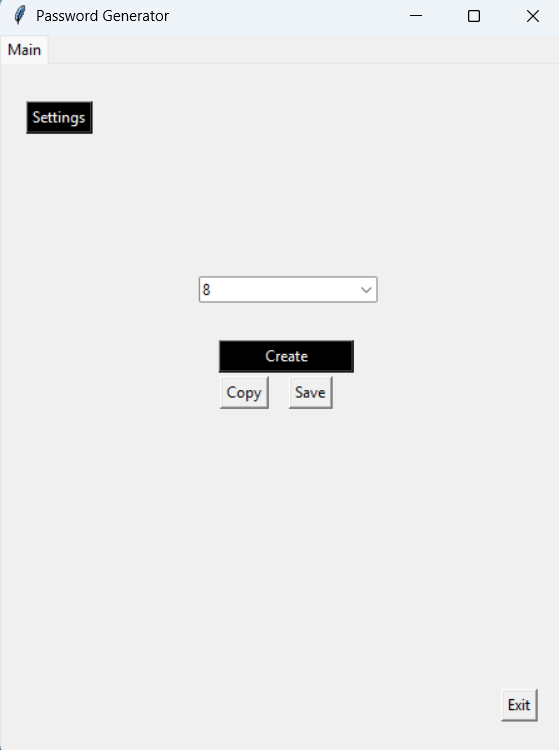
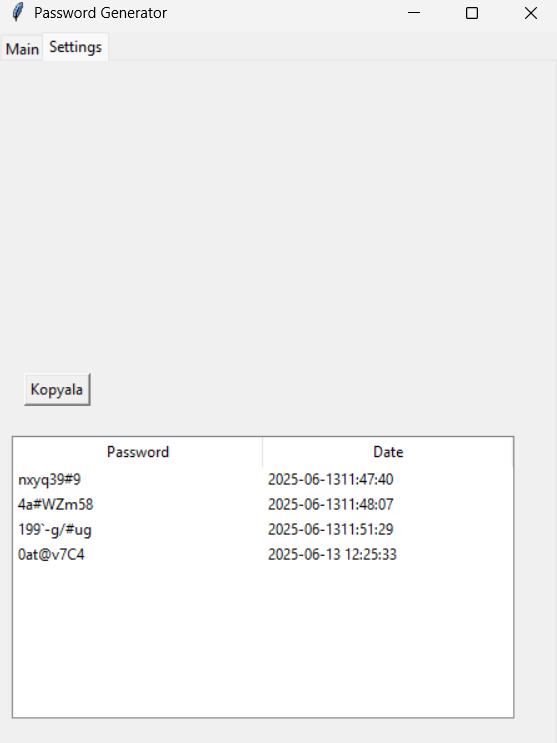

# Password Generator

<b>This Tkinter desktop 
application calls the passwords   
with the interface and shortcuts saves the passwords   
with their datesin the database   
and we use our own   password manager.

# General features

Use tkinter
````bash
pip install tkinter
````
Use sqlite3
````
pip install sqlite3
````
Use Keyboard
````
pip install keyboard
````

The Tkinter library provides the user interface, while SQLite creates a password manager by storing passwords in the database, and the keyboard module provides communication with shortcuts.

Same Shortcuts:
````
ctrl+shift+f | Creates a 14 digit password
````
````
ctrl+shift+t | Creates a 12 digit password
````
````
ctrl+shift+r | Creates a 10 digit password
````
````
ctrl+shift+e | Creates a 8 digit password
````
````
ctrl+shift+s | Creates a 6 digit password
````


# General Images



